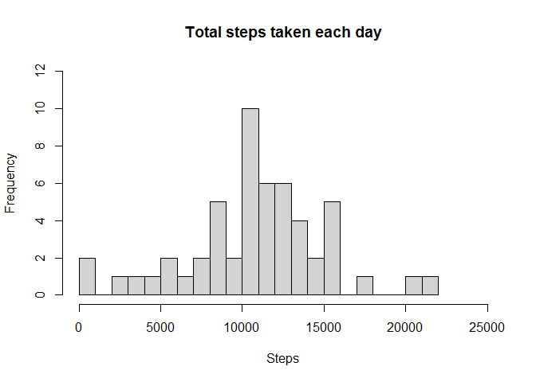
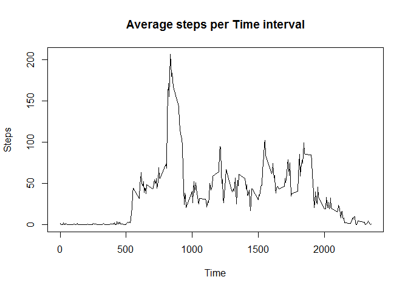
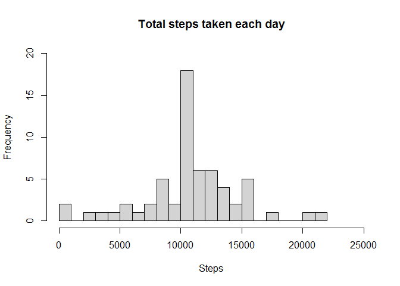

## "Reproducible Research: Peer Assessment 1"


## Loading and preprocessing the data

Show any code that is needed to:

1. Load the data (i.e. read.csv())
2. Process/transform the data (if necessary) into a format suitable for your analysis


```r
##Libraries
library(dplyr)
library(lattice)
```


```r
#Loading the data
activityData <- read.csv("./activity.csv")
str(activityData)
```

```
## 'data.frame':	17568 obs. of  3 variables:
##  $ steps   : int  NA NA NA NA NA NA NA NA NA NA ...
##  $ date    : chr  "2012-10-01" "2012-10-01" "2012-10-01" "2012-10-01" ...
##  $ interval: int  0 5 10 15 20 25 30 35 40 45 ...
```

## What is mean total number of steps taken per day?

**1. Calculate the total number of steps taken per day**


```r
stepsPerDay <- aggregate(steps ~ date, activityData, sum, na.rm=TRUE)
stepsPerDay$date <- as.Date(stepsPerDay$date)
stepsPerDay$steps<- as.numeric(stepsPerDay$steps)
head(stepsPerDay)
```

```
##         date steps
## 1 2012-10-02   126
## 2 2012-10-03 11352
## 3 2012-10-04 12116
## 4 2012-10-05 13294
## 5 2012-10-06 15420
## 6 2012-10-07 11015
```

**2. Make a histogram of the total number of steps taken each day**


```r
hist(stepsPerDay$steps, 
     main = "Total steps taken each day",
     xlab = "Steps",
     xlim = c(0, 25000),
     ylim = c(0, 12),
     breaks = 20)
```

<!-- -->

**3. Calculate and report the mean and median of the total number of steps taken per day**


```r
meanTotalSteps <- mean(stepsPerDay$steps)
meanTotalSteps #Mean
```

```
## [1] 10766.19
```

```r
medianTotalSteps <- median(stepsPerDay$steps)
medianTotalSteps #Median
```

```
## [1] 10765
```

## What is the average daily activity pattern?

**1. Make a time series plot (i.e. type = "l") of the 5-minute interval (x-axis) and the average number of steps taken, averaged across all days (y-axis)**


```r
stepsPerInterval<-aggregate(steps~interval, data=activityData, mean, na.rm=TRUE)
head(stepsPerInterval)
```

```
##   interval     steps
## 1        0 1.7169811
## 2        5 0.3396226
## 3       10 0.1320755
## 4       15 0.1509434
## 5       20 0.0754717
## 6       25 2.0943396
```

```r
plot(steps~interval, data=stepsPerInterval, type="l", 
     main = "Average steps per Time interval",
     xlab = "Time",
     ylab = "Steps")
```

<!-- -->

**2. Which 5-minute interval, on average across all the days in the dataset, contains the maximum number of steps?**


```r
#table using dplyr
Subset <- tbl_df(stepsPerInterval)
#find the column
MaxSteps <- Subset %>% select(interval, steps) %>% filter(steps==max(Subset$steps))
MaxSteps
```

```
## # A tibble: 1 x 2
##   interval steps
##      <int> <dbl>
## 1      835  206.
```

## Imputing missing values

**1. Calculate and report the total number of missing values in the dataset (i.e. the total number of rows with NAs)**


```r
#table, filter and summarize the missing values
isNA <- tbl_df(activityData) %>% filter(is.na(steps)) %>% summarize(missing_values = n())
isNA
```

```
## # A tibble: 1 x 1
##   missing_values
##            <int>
## 1           2304
```

**2. Devise a strategy for filling in all of the missing values in the dataset.**

In this case as an strategy, values of the average 5-minute interval are used to replace the NA values.


```r
#Values without NA are imputed in a new column
activityData$withoutNASteps <- ifelse(is.na(activityData$steps),
                        round(stepsPerInterval$steps[match(activityData$interval, stepsPerInterval$interval)],0), 
                        activityData$steps)
```

**3. Create a new dataset that is equal to the original dataset but with the missing data filled in.**


```r
activityNewData <- data.frame(steps=activityData$withoutNASteps, interval=activityData$interval, date=activityData$date)

head(activityNewData)
```

```
##   steps interval       date
## 1     2        0 2012-10-01
## 2     0        5 2012-10-01
## 3     0       10 2012-10-01
## 4     0       15 2012-10-01
## 5     0       20 2012-10-01
## 6     2       25 2012-10-01
```

**4.1.Make a histogram of the total number of steps taken each day.**


```r
stepsPerDayNew <- aggregate(steps ~ date, activityNewData, sum)
stepsPerDayNew$date <- as.Date(stepsPerDayNew$date)
stepsPerDayNew$steps<- as.numeric(stepsPerDayNew$steps)
hist(stepsPerDayNew$steps, 
     main = "Total steps taken each day",
     xlab = "Steps",
     xlim = c(0, 25000),
     ylim = c(0, 20),
     breaks = 20)
```

<!-- -->

**4.1.1. Calculate and report the mean and median total number of steps taken per day.**


```r
meanTotalStepsNew <- mean(stepsPerDayNew$steps)
meanTotalStepsNew #Mean
```

```
## [1] 10765.64
```

```r
medianTotalStepsNew <- median(stepsPerDayNew$steps)
medianTotalStepsNew #Median
```

```
## [1] 10762
```

**4.2. Do these values differ from the estimates from the first part of the assignment? What is the impact of imputing missing data on the estimates of the total daily number of steps?**

Imputation of missing data has a small, transferable impact on the mean and median total daily number of steps.
Looking at the histogram, we can see that the only interval that is changed is the interval between 10,000 and 11,000 steps, increased in frequency.
Different results could be obtained by using different methods to replace missing values.


```r
((1 - (meanTotalStepsNew/meanTotalSteps))*100) #relationship between means
```

```
## [1] 0.005102409
```

```r
((1 - (medianTotalStepsNew/medianTotalSteps))*100) #relationship between medians
```

```
## [1] 0.02786809
```


## Are there differences in activity patterns between weekdays and weekends?
For this part the weekdays() function may be of some help here. 
Use the dataset with the filled-in missing values for this part.

**1.Create a new factor variable in the dataset with two levels – “weekday” and “weekend” – indicating whether a given date is a weekday or weekend day.**


```r
Sys.setlocale("LC_TIME", "English")
```

```
## [1] "English_United States.1252"
```

```r
activityNewData$date <- as.Date(activityNewData$date, format = "%Y-%m-%d")

#create a variable with weekdays name
activityNewData$weekday <- weekdays(activityNewData$date)

#create a new variable indicating weekday or weekend
activityNewData$Day <- ifelse(activityNewData$weekday=='Saturday' | activityNewData$weekday=='Sunday', 'weekend','weekday')

head(activityNewData)
```

```
##   steps interval       date weekday     Day
## 1     2        0 2012-10-01  Monday weekday
## 2     0        5 2012-10-01  Monday weekday
## 3     0       10 2012-10-01  Monday weekday
## 4     0       15 2012-10-01  Monday weekday
## 5     0       20 2012-10-01  Monday weekday
## 6     2       25 2012-10-01  Monday weekday
```

**2. Make a panel plot containing a time series plot (i.e. type = "l") of the 5-minute interval (x-axis) and the average number of steps taken, averaged across all weekday days or weekend days (y-axis).** See the README file in the GitHub repository to see an example of what this plot should look like using simulated data.


```r
stepsPerInvervalNew <- aggregate(steps~interval+Day,data=activityNewData,FUN=mean)
stepsPerInvervalNew$interval <- as.numeric(stepsPerInvervalNew$interval)

#Using lattice
xyplot(steps ~ interval | Day, stepsPerInvervalNew, type = "l", layout = c(1, 2), 
       xlab = "Interval", ylab = "Number of Steps")
```

<!-- -->
